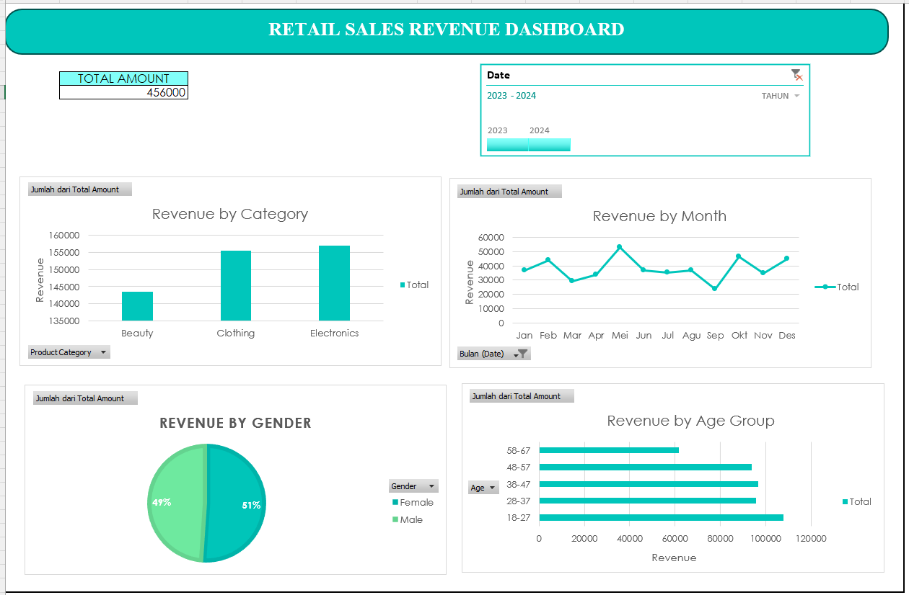

# 📊 Retail Sales Dashboard (Excel)

## 📌 Project Overview
This project focuses on analyzing retail sales transaction data using **Microsoft Excel**.  
The goal is to transform raw sales data into meaningful insights through **Pivot Tables, Charts, and an interactive Dashboard**.

This project is part of my data analysis portfolio to demonstrate my ability to:
- Understand business data
- Perform basic analysis
- Create clear and informative visualizations

---

## 🎯 Objective
- Analyze retail sales performance
- Identify sales trends over time
- Understand customer distribution by age group and gender
- Provide a clear summary through an Excel dashboard

---

## 📂 Dataset Overview
- Type: Retail sales transaction data
- Content includes:
  - Order date
  - Customer age group
  - Gender
  - Product category
  - Quantity
  - Price per unit
  - Total amount
- The dataset has been cleaned and formatted for analysis.

📁 **Raw dataset** can be found in the `Data/` folder.

---

## 🛠 Tools Used
- Microsoft Excel
  - Pivot Tables
  - Pivot Charts
  - Slicers
  - Dashboard Design

---

## 📊 Dashboard Preview

---

## 🔍 Key Insights
- Total sales show clear differences between product categories
- Customer age groups have varying purchasing patterns
- Sales performance differs by gender
- Time-based analysis helps identify overall sales trends

---

## 📁 Project Structure
